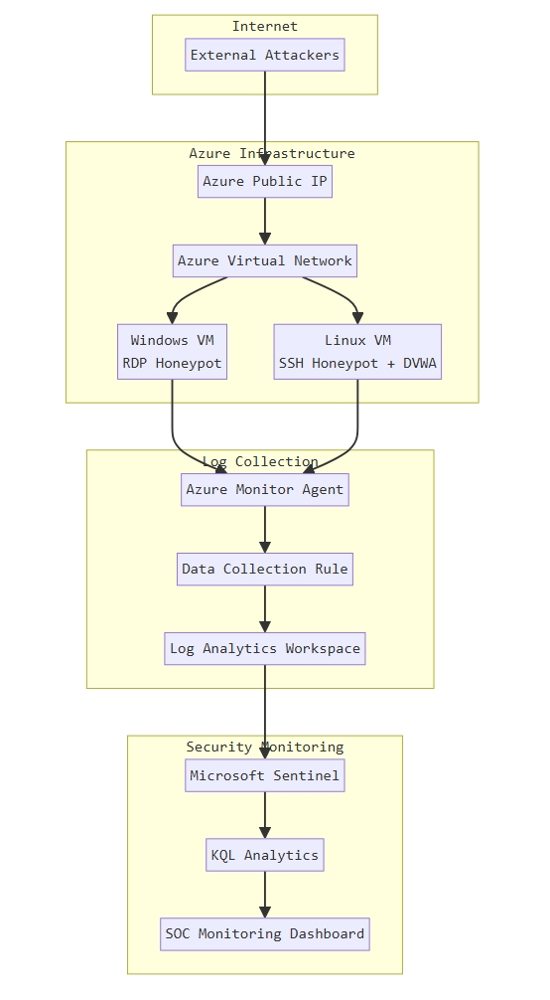
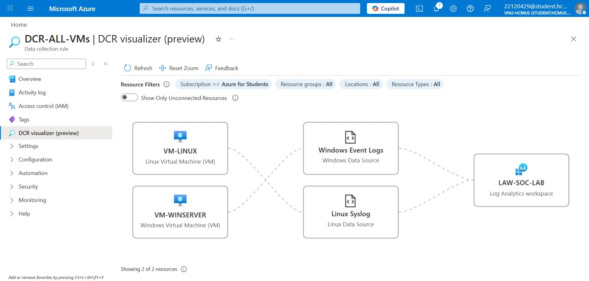
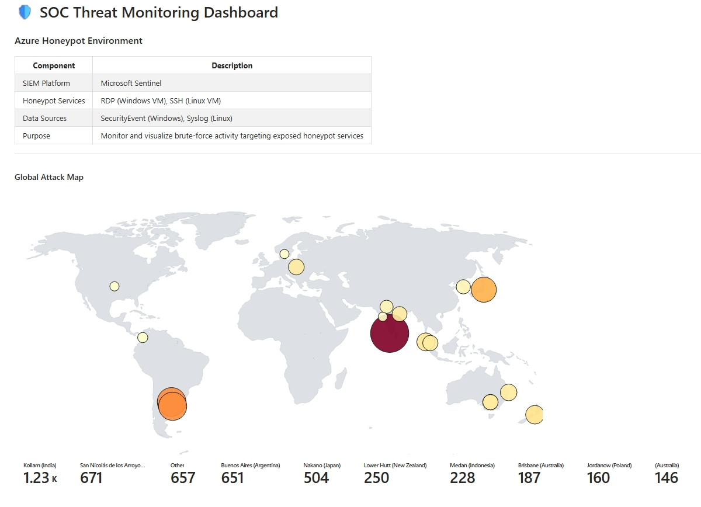
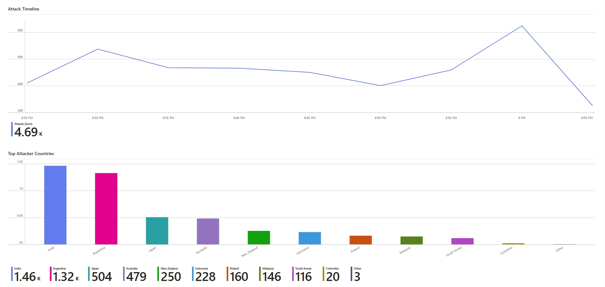
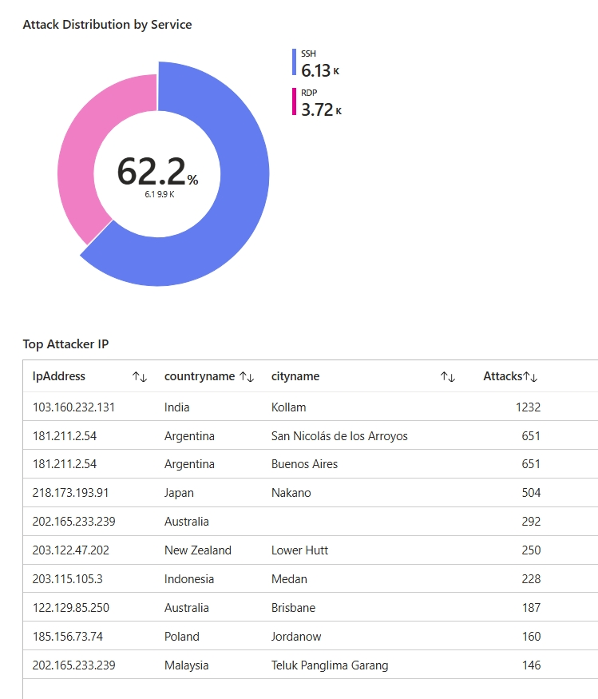

# Azure Sentinel Honeypot SOC Lab

## Giới thiệu

Đây là một lab cá nhân mình dựng trên Azure để thử mô phỏng quy trình giám sát an ninh cơ bản bằng Microsoft Sentinel. Trong lab này, các máy honeypot được đặt public để ghi nhận các nỗ lực đăng nhập từ Internet, sau đó log được thu thập về Log Analytics và phân tích bằng KQL.

Dữ liệu được trực quan hóa bằng Sentinel Workbook để dễ quan sát nguồn tấn công, tần suất theo thời gian và các tài khoản thường bị brute-force.

Repo này ghi lại các phần chính của lab, bao gồm:

- Thiết lập nguồn log từ Windows và Linux VM
- Một số truy vấn KQL dùng để phân tích các sự kiện đăng nhập thất bại
- Cấu hình workbook để trực quan hóa hoạt động tấn công

---

## Môi trường lab

Lab sử dụng hai máy ảo trên Azure được gán public IP: 

- Windows VM mở RDP để ghi nhận các lần đăng nhập thất bại
- Linux VM mở SSH để ghi nhận các lần dò mật khẩu

Toàn bộ log được đẩy về Log Analytics Workspace thông qua Azure Monitor Agent, sau đó Microsoft Sentinel dùng các truy vấn KQL để tổng hợp dữ liệu và hiển thị trên workbook.

---

## Kiến trúc



Các thành phần chính trong mô hình:

- Azure Virtual Network
- Windows honeypot VM
- Linux honeypot VM
- Azure Monitor Agent
- Log Analytics Workspace
- Microsoft Sentinel

Luồng dữ liệu tổng quát:

Internet attacker → Public IP → Honeypot VM → Azure Monitor Agent → Log Analytics Workspace → Microsoft Sentinel → Workbook

---

## Thu thập log

Lab hiện tập trung vào hai nguồn log chính:

| Nguồn log | Dữ liệu thu thập |
| --- | --- |
| Windows VM | `SecurityEvent` với `EventID == 4625` |
| Linux VM | `Syslog` chứa chuỗi `Failed password` |

Đây là hai loại log đủ để quan sát hành vi brute-force phổ biến trên RDP và SSH.

Ví dụ cấu hình Data Collection Rule:



---

## Dashboard trong Sentinel

Workbook trong repo được dùng để theo dõi nhanh các chỉ số tấn công quan trọng, bao gồm:

- Bản đồ vị trí địa lý của nguồn tấn công
- Xu hướng tấn công theo thời gian
- Phân bố tấn công theo dịch vụ RDP và SSH
- IP tấn công nhiều nhất
- Quốc gia phát sinh nhiều kết nối độc hại
- Tài khoản bị nhắm tới nhiều nhất

Một số ảnh chụp từ workbook:







---

## Các truy vấn KQL chính

Thư mục `queries/` chứa các truy vấn mình dùng để dựng workbook và phân tích log. Nội dung chính gồm:

- `attack-map.kql`: gộp log từ Windows và Linux, enrich GeoIP bằng watchlist để hiển thị bản đồ tấn công
- `attack-timeline.kql`: thống kê số lần tấn công theo từng mốc 5 phút
- `attacker-countries.kql`: tổng hợp số lượng attack theo quốc gia
- `top-attacker-ip.kql`: liệt kê các IP có số lần tấn công cao nhất
- `most-targeted-account.kql`: thống kê các tài khoản bị thử đăng nhập nhiều nhất
- `attack-distribution.kql`: so sánh tỷ lệ tấn công giữa RDP và SSH

Ví dụ truy vấn phát hiện brute-force từ Windows:

```kusto
SecurityEvent
| where EventID == 4625
| summarize Attempts = count() by IpAddress
| order by Attempts desc
```

Ví dụ truy vấn phát hiện brute-force từ Linux:

```kusto
Syslog
| where SyslogMessage contains "Failed password"
| extend IpAddress = extract(@"\d+\.\d+\.\d+\.\d+", 0, SyslogMessage)
| summarize Attempts = count() by IpAddress
| order by Attempts desc
```

---

## Sentinel Workbook

File workbook nằm tại:

[dashboard/sentinel-workbook.json](dashboard/sentinel-workbook.json)

Có thể import trực tiếp file này vào Microsoft Sentinel để dựng lại dashboard của lab.

Lưu ý: một số truy vấn dùng watchlist `geoip` để enrich dữ liệu vị trí địa lý, nên khi import sang môi trường khác cần tạo watchlist tương ứng để bản đồ hoạt động đúng.

---

## GeoIP dataset

File [geoip-summarized.csv](geoip-summarized.csv)
 được dùng làm watchlist trong Microsoft Sentinelđể enrich IP attacker với thông tin vị trí địa lý.

---

## Công nghệ sử dụng

| Công nghệ | Mục đích |
|------|------|
| Microsoft Sentinel | SIEM và dashboard giám sát |
| Azure Monitor Agent | Thu thập log từ VM |
| Log Analytics Workspace | Lưu trữ và truy vấn log |
| Kusto Query Language (KQL) | Phân tích dữ liệu bảo mật |
| Azure Virtual Machines | Mô phỏng honeypot |
| Sentinel Workbooks | Trực quan hóa dữ liệu |


---

## Những điều rút ra từ lab

Lab này giúp mình thử qua một số bước cơ bản trong việc thiết lập và quan sát
một môi trường SOC nhỏ trên Azure, bao gồm:

- Cấu hình thu thập log từ Windows và Linux VM
- Viết truy vấn KQL để phân tích các lần đăng nhập thất bại
- Xây dashboard trong Microsoft Sentinel để theo dõi nguồn tấn công
- Sử dụng GeoIP để enrich địa chỉ IP và bổ sung bối cảnh cho việc phân tích

---

## Cấu trúc repo

```text
architecture/
dashboard/
docs/
queries/
data/
README.md
```

---

## Tài liệu tham khảo

- [Microsoft Sentinel Documentation](https://docs.azure.cn/en-us/sentinel/) – hướng dẫn về SIEM và các tính năng giám sát trong Sentinel  
- [Azure Monitor Documentation](https://learn.microsoft.com/en-us/azure/azure-monitor/) – tài liệu về thu thập và quản lý log trên Azure  
- [Kusto Query Language (KQL) Documentation](https://learn.microsoft.com/en-us/kusto/query/?view=microsoft-fabric) – tham khảo cú pháp truy vấn dùng trong Log Analytics và Sentinel
